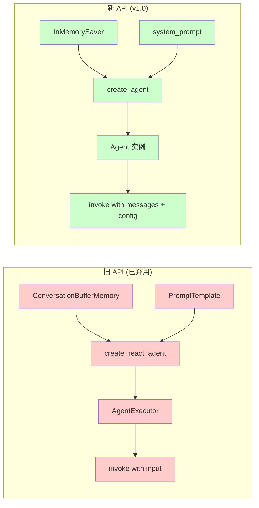
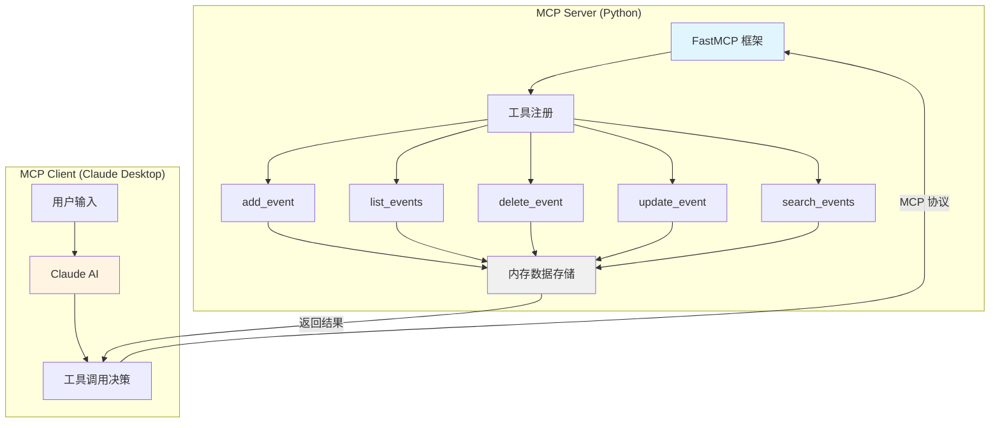
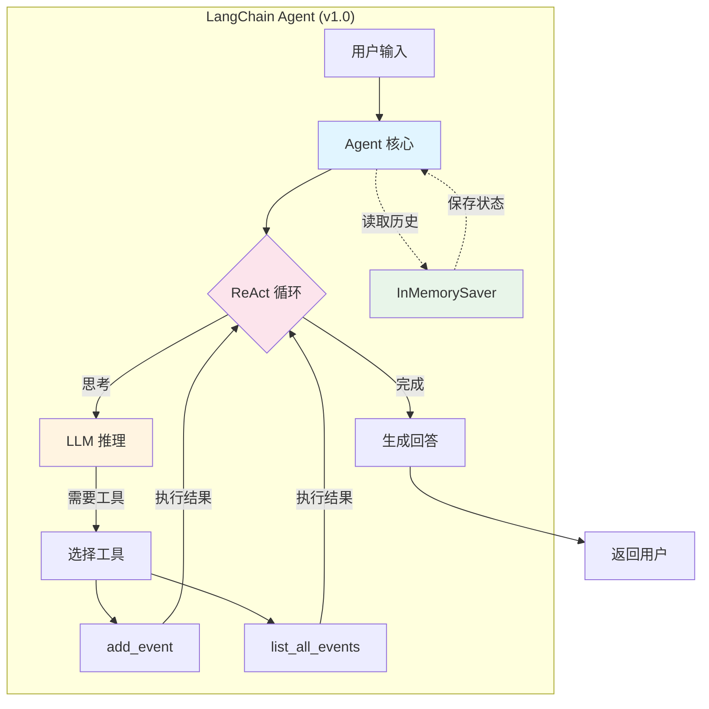
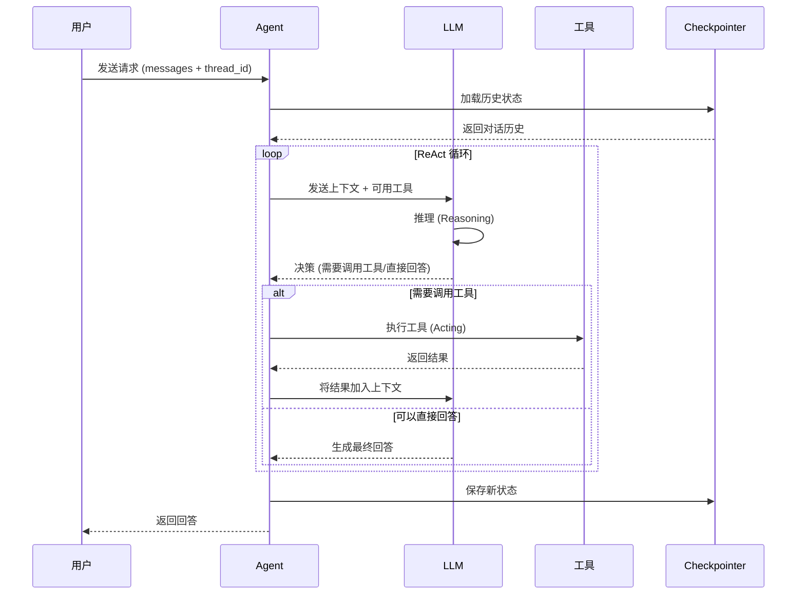
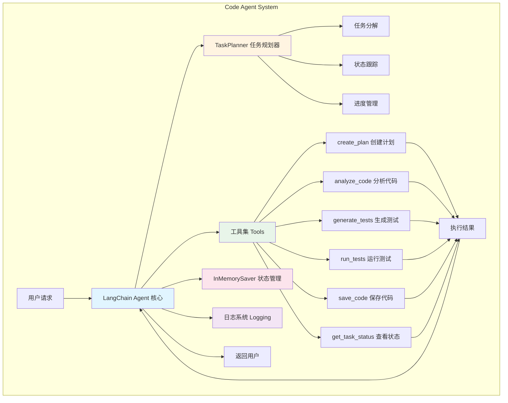
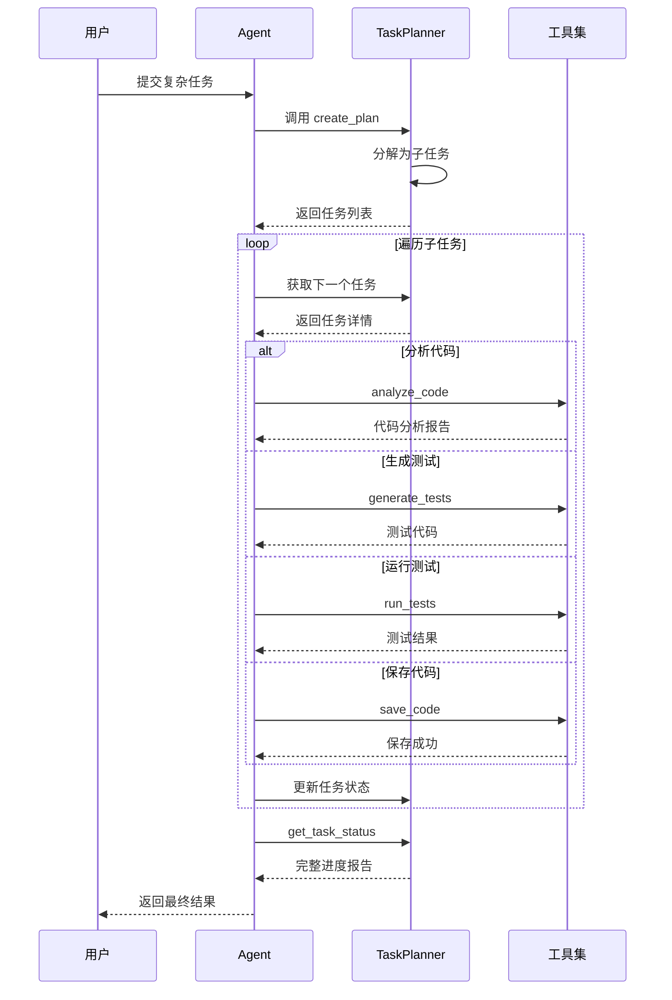
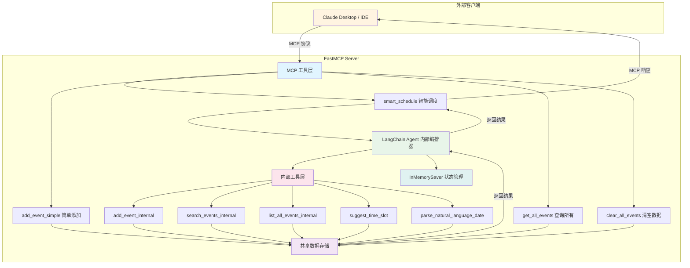
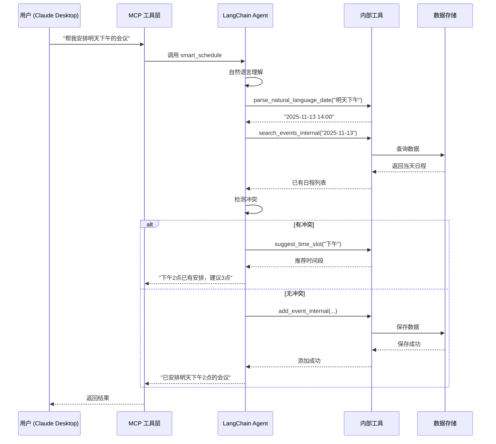
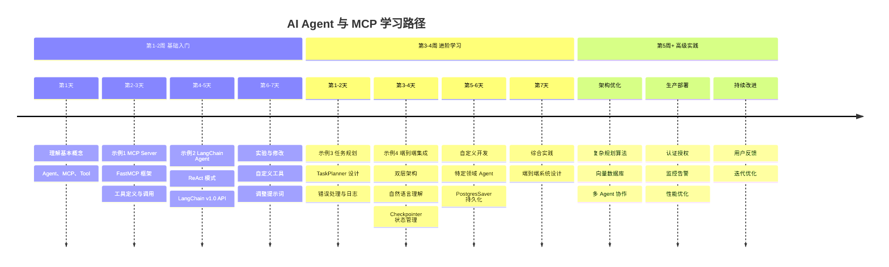

# AI Agent 与 MCP 实践示例代码

本目录包含一系列循序渐进的示例代码，帮助您理解和实践 AI Agent 与 MCP（Model Context Protocol）的核心概念。

## 目录结构

```text
examples/
├── 01_calendar_server.py           # MCP Server 基础示例
├── 02_langchain_basic_agent.py     # LangChain Agent 基础示例
├── 03_code_agent_with_planning.py  # 完整的代码 Agent（具有规划能力）
├── 04_integrated_mcp_langchain.py  # FastMCP + LangChain 端到端集成
└── README.md                        # 本文档
```

## ⚠️ 重要说明：LangChain v1.0 API

本示例代码已更新至 **LangChain v1.0** 的新 API。主要变化包括：

- ✅ 使用 `create_agent` 替代旧的 `create_react_agent` + `AgentExecutor`
- ✅ 使用 `checkpointer`（如 `InMemorySaver`）替代旧的 `ConversationBufferMemory`
- ✅ 使用 `system_prompt` 参数替代 `PromptTemplate`
- ✅ 使用 `thread_id` 配置来维护会话状态
- ✅ 需要安装 `langgraph` 包以使用新的状态管理功能

如果您使用的是旧版本的 LangChain，建议升级到最新版本以获得更好的性能和功能。

### API 迁移对比



## 前置准备

### 1. 环境要求

- Python 3.9 或更高版本
- pip 包管理器
- （可选）虚拟环境工具

### 2. 安装依赖

#### 方式一：一次性安装所有依赖

```bash
pip install fastmcp langchain langchain-openai langgraph
```

#### 方式二：按需安装（推荐）

根据您要运行的示例，选择性安装：

**示例 1** - MCP Server：

```bash
pip install fastmcp
```

**示例 2、3 和 4** - LangChain Agent：

```bash
pip install langchain langchain-openai langgraph
```

**注意：** 本示例使用 **LangChain v1.0** 的新 API，需要安装 `langgraph` 包以使用 `InMemorySaver` 等功能。

### 3. 配置 API 密钥

示例 2 和 3 需要 OpenAI API 密钥。

#### 获取 API 密钥

1. 访问 [OpenAI Platform](https://platform.openai.com/)
2. 注册/登录账号
3. 进入 API Keys 页面创建新密钥

#### 设置环境变量

**Windows:**

```cmd
set OPENAI_API_KEY=sk-your-key-here
```

**Linux/macOS:**

```bash
export OPENAI_API_KEY=sk-your-key-here
```

**持久化配置（推荐）:**

在用户目录下创建 `.env` 文件：

```bash
OPENAI_API_KEY=sk-your-key-here
```

然后安装并使用 python-dotenv：

```bash
pip install python-dotenv
```

在代码开头添加：

```python
from dotenv import load_dotenv
load_dotenv()
```

## 示例说明

### 示例 1：MCP Calendar Server

**文件：** `01_calendar_server.py`

**学习目标：**

- 理解 MCP Server 的基本概念
- 学会使用 FastMCP 框架
- 掌握工具（Tool）的定义方法
- 了解 MCP 协议的通信机制

### 架构设计



**功能特性：**

- ✅ 添加日程（add_event）
- ✅ 列出所有日程（list_events）
- ✅ 删除日程（delete_event）
- ✅ 更新日程（update_event）
- ✅ 搜索日程（search_events）

**运行步骤：**

1. **启动 MCP Server**

   ```bash
   python 01_calendar_server.py
   ```

2. **配置客户端（以 Claude Desktop 为例）**

   找到配置文件：
   - **Windows:** `%APPDATA%\Claude\claude_desktop_config.json`
   - **macOS:** `~/Library/Application Support/Claude/claude_desktop_config.json`
   - **Linux:** `~/.config/Claude/claude_desktop_config.json`

   添加以下配置：

   ```json
   {
     "mcpServers": {
       "calendar": {
         "command": "python",
         "args": ["D:/Project/sast_cxx_lessons/00-vibe-coding/examples/01_calendar_server.py"],
         "env": {}
       }
     }
   }
   ```

   **注意：** 请将路径替换为您的实际绝对路径。

3. **重启 Claude Desktop**

4. **测试工具**

   在 Claude Desktop 中尝试以下命令：
   - "列出所有可用的工具"
   - "帮我添加11月15日的团队会议"
   - "列出我所有的日程"
   - "搜索包含'会议'的日程"

**预期输出：**

```text
Calendar MCP Server 启动中...
可用工具：
  - add_event: 添加日程
  - list_events: 列出所有日程
  - delete_event: 删除日程
  - update_event: 更新日程
  - search_events: 搜索日程
```

**常见问题：**

❌ **问题：** 客户端无法发现工具
✅ **解决：**

- 检查配置文件路径是否正确
- 确认 JSON 格式无误
- 验证 Python 路径和脚本路径是否为绝对路径
- 重启客户端

❌ **问题：** 工具调用失败
✅ **解决：**

- 查看服务器终端的错误日志
- 确认参数格式是否正确
- 检查是否有权限问题

---

### 示例 2：LangChain 基础 Agent

**文件：** `02_langchain_basic_agent.py`

**学习目标：**

- 理解 Agent 的核心组件（LLM、Tool、Checkpointer、Prompt）
- 学会使用 LangChain v1.0 框架
- 掌握 ReAct 模式（推理-行动循环）
- 了解对话记忆的作用

### Agent 架构



### ReAct 执行流程



**核心概念：**

1. **Tool（工具）**
   - 定义：Agent 可以调用的函数
   - 作用：扩展 Agent 的能力边界
   - 示例：add_event、list_all_events

2. **LLM（大语言模型）**
   - 定义：负责推理和决策的核心
   - 作用：理解用户意图、选择合适的工具
   - 示例：GPT-4o-mini

3. **Checkpointer（检查点）**
   - 定义：保存对话历史和状态（替代旧的 Memory）
   - 作用：实现多轮对话的连贯性和状态持久化
   - 示例：InMemorySaver（开发测试）、PostgresSaver（生产环境）

4. **ReAct 模式**
   - Reasoning（推理）：思考需要做什么
   - Acting（行动）：调用工具执行
   - 循环往复直到完成任务

**运行步骤：**

1. **确认环境变量**

   ```bash
   # Windows
   echo %OPENAI_API_KEY%

   # Linux/macOS
   echo $OPENAI_API_KEY
   ```

2. **运行示例**

   ```bash
   python 02_langchain_basic_agent.py
   ```

3. **观察执行过程**

   程序会自动运行 4 个示例：
   - 示例 1：添加日程
   - 示例 2：再添加一个日程
   - 示例 3：查看所有日程
   - 示例 4：测试记忆功能

**预期输出示例：**

```text
============================================================
LangChain 基础 Agent 示例
============================================================

【示例 1】添加日程
------------------------------------------------------------

最终回答：我已经帮您添加了11月15日的团队会议。

【示例 2】再添加一个日程
------------------------------------------------------------

最终回答：好的，我已经帮您添加了11月16日的项目评审。

【示例 3】查看所有日程
------------------------------------------------------------

最终回答：您当前有以下日程：
1. 2025-11-15 - 团队会议
2. 2025-11-16 - 项目评审

【示例 4】测试记忆功能
------------------------------------------------------------

最终回答：您第一个添加的日程是2025-11-15的团队会议。
```

**代码解析：**

```python
# 1. 定义工具 - 使用 @tool 装饰器
@tool
def add_event(date: str, title: str) -> str:
    """文档字符串会被 Agent 用来理解工具的功能"""
    EVENTS.append({"date": date, "title": title})
    return f"已成功添加日程：{date} - {title}"

# 2. 初始化 LLM
llm = ChatOpenAI(model="gpt-4o-mini", temperature=0)

# 3. 配置记忆（使用 Checkpointer）
checkpointer = InMemorySaver()  # 替代旧的 ConversationBufferMemory

# 4. 定义系统提示词
system_prompt = """你是一个专业的日程助理..."""

# 5. 创建 Agent（使用新的 create_agent API）
agent = create_agent(
    model=llm,
    tools=tools,
    system_prompt=system_prompt,
    checkpointer=checkpointer,
)

# 6. 运行 Agent
config = {"configurable": {"thread_id": "1"}}
response = agent.invoke({
    "messages": [{"role": "user", "content": "用户的请求"}]
}, config)
```

**API 版本说明：**

本示例使用 **LangChain v1.0** 的新 API：

- ✅ 使用 `create_agent` 替代旧的 `create_react_agent` + `AgentExecutor`
- ✅ 使用 `checkpointer` 替代旧的 `ConversationBufferMemory`
- ✅ 使用 `system_prompt` 参数替代 `PromptTemplate`
- ✅ 使用 `thread_id` 来维护会话状态

**实验建议：**

1. **修改提示词** - 尝试改变 Agent 的行为风格
2. **添加新工具** - 实现更多日程管理功能
3. **调整温度参数** - 观察输出的随机性变化
4. **测试记忆功能** - 使用不同的 thread_id 创建独立会话

---

### 示例 3：完整的代码 Agent（具有规划能力）

**文件：** `03_code_agent_with_planning.py`

**学习目标：**

- 掌握复杂 Agent 的设计模式
- 理解任务规划（Planning）的实现
- 学会错误处理和日志记录
- 实践完整的工作流程

### 系统架构



### 任务执行流程



**核心特性：**

1. **任务规划（Planning）**

   ```python
   class TaskPlanner:
       def add_task(self, description: str) -> int
       def update_status(self, task_id: int, status: TaskStatus)
       def get_summary(self) -> str
   ```

   - 自动分解复杂任务
   - 跟踪每个子任务的状态
   - 生成进度报告

2. **工具集（Tools）**
   - `create_plan` - 创建详细的任务计划
   - `analyze_code` - 检查代码质量
   - `generate_tests` - 自动生成单元测试
   - `run_tests` - 执行测试用例
   - `save_code` - 保存到代码库
   - `get_task_status` - 查看任务状态

3. **记忆系统（Memory）**
   - 保存完整的对话历史
   - 记住之前的分析结果
   - 支持上下文关联

4. **错误处理**
   - 异常捕获和记录
   - 自动重试机制
   - 优雅降级

5. **可观测性**
   - 详细的日志输出
   - 任务状态可视化
   - 执行过程透明化

**运行步骤：**

1. **运行示例**

   ```bash
   python 03_code_agent_with_planning.py
   ```

2. **观察执行流程**

   Agent 会依次执行以下步骤：

   ```text
   Step 1: 创建任务计划
   ├─ 子任务 1: 分析代码质量
   ├─ 子任务 2: 生成单元测试
   ├─ 子任务 3: 运行测试
   ├─ 子任务 4: 保存代码
   └─ 子任务 5: 生成总结报告

   Step 2: 执行每个子任务
   ├─ [执行中] 分析代码质量
   │   └─ [完成] 发现 2 个潜在问题
   ├─ [执行中] 生成单元测试
   │   └─ [完成] 生成了 3 个测试用例
   ...

   Step 3: 生成总结报告
   └─ 所有任务已完成，保存了 2 个文件到代码库
   ```

**预期输出：**

```text
================================================================================
代码助手 Agent（具有规划能力）
================================================================================

【任务】完整的代码审查和测试流程
--------------------------------------------------------------------------------

Agent 执行过程（简化版）：

思考: 这是一个复杂任务，需要创建详细的计划
行动: create_plan
行动输入: {"task_description": "代码审查和测试流程", "subtasks": "[...]"}

观察: 成功创建计划，包含 5 个子任务
⏳ [ID: 0] 分析代码质量 - pending
⏳ [ID: 1] 生成单元测试 - pending
⏳ [ID: 2] 运行测试 - pending
⏳ [ID: 3] 保存代码和测试 - pending
⏳ [ID: 4] 生成总结报告 - pending

思考: 开始执行第一个子任务
行动: analyze_code
行动输入: {"code": "...", "language": "python"}

观察: 代码分析报告（python）
总行数: 5
注释行: 0

发现的问题:
  ⚠️ 缺少文档字符串
  ⚠️ 注释较少，建议增加注释

...

================================================================================
最终答案:
================================================================================

我已完成对代码的完整审查和测试流程：

✅ **任务完成情况**
1. ✅ 代码分析：发现 2 个改进建议
2. ✅ 测试生成：创建了 3 个测试用例
3. ✅ 测试运行：1 个通过，2 个待实现
4. ✅ 代码保存：已保存源码和测试

📊 **总结**
- 代码质量：中等，需要添加文档和注释
- 测试覆盖：基础框架已生成，需完善具体用例
- 建议：补充边界测试和错误处理测试

📁 **已保存文件**
- calculate_average.py
- test_calculate_average.py

================================================================================
代码库内容:
================================================================================

文件: calculate_average.py
--------------------------------------------------------------------------------
def calculate_average(numbers):
    total = sum(numbers)
    count = len(numbers)
    return total / count

文件: test_calculate_average.py
--------------------------------------------------------------------------------
import unittest

class TestCalculate_average(unittest.TestCase):
    """测试 calculate_average 函数"""
    ...
```

**代码解析：**

1. **任务规划器**

   ```python
   class TaskPlanner:
       """负责任务分解和状态管理"""

       def add_task(self, description: str) -> int:
           """添加新任务到计划中"""

       def update_status(self, task_id: int, status: TaskStatus):
           """更新任务状态"""

       def get_summary(self) -> str:
           """生成任务摘要"""
   ```

2. **工具定义示例**

   ```python
   @tool
   def analyze_code(code: str, language: str = "python") -> str:
       """
       分析代码质量

       这个函数展示了如何：
       1. 接收复杂的输入参数
       2. 执行实际的分析逻辑
       3. 返回结构化的结果
       """
       # 实际的分析逻辑...
       return report
   ```

3. **Agent 配置（使用 LangChain v1.0 API）**

   ```python
   def create_code_agent():
       """创建配置完整的 Agent"""

       # 1. 初始化 LLM
       llm = ChatOpenAI(model="gpt-4o-mini", temperature=0)

       # 2. 配置记忆（使用 Checkpointer）
       checkpointer = InMemorySaver()

       # 3. 定义系统提示词（包含工作流程指导）
       system_prompt = """你是一个专业的代码助手 Agent..."""

       # 4. 准备工具集
       tools = [create_plan, analyze_code, generate_tests, run_tests, save_code, get_task_status]

       # 5. 使用新的 create_agent API 创建 Agent
       agent = create_agent(
           model=llm,
           tools=tools,
           system_prompt=system_prompt,
           checkpointer=checkpointer,
       )

       return agent
   ```

**API 版本说明：**

本示例使用 **LangChain v1.0** 的新 API：

- ✅ 使用 `create_agent` 替代旧的 `create_react_agent` + `AgentExecutor`
- ✅ 使用 `checkpointer` 替代旧的 `ConversationBufferMemory`
- ✅ 使用 `system_prompt` 参数替代 `PromptTemplate`
- ✅ 使用 `thread_id` 来维护会话状态

**实验建议：**

1. **修改示例代码**
   - 尝试不同的函数实现
   - 添加故意的错误，观察 Agent 的反应

2. **扩展工具集**
   - 添加代码重构工具
   - 添加性能分析工具
   - 添加文档生成工具

3. **调整规划策略**
   - 修改提示词中的工作流程
   - 添加更细粒度的子任务
   - 实现动态规划调整

4. **增强错误处理**
   - 添加重试机制
   - 实现回滚功能
   - 添加更详细的错误日志

---

### 示例 4：FastMCP + LangChain 端到端集成

**文件：** `04_integrated_mcp_langchain.py`

**学习目标：**

- 理解 FastMCP 和 LangChain 的集成方式
- 掌握端到端 AI Agent 系统的架构设计
- 学习智能自然语言理解的实现
- 实践多层次工具系统的构建

**应用场景：**

- 智能日程管理：自然语言输入自动解析为日程操作
- 复杂查询：结合多个条件进行智能搜索和推荐
- 自动规划：根据上下文自动建议最佳日程安排

### 双层架构设计



### 交互序列图



**核心特性：**

1. **双层工具架构**
   - 外层 MCP 工具：暴露给外部客户端（Claude、IDE 等）
   - 内层 LangChain 工具：供内部 Agent 智能编排使用
   - 清晰的职责分离和灵活的组合能力

2. **智能自然语言理解**
   - 解析相对日期：今天、明天、下周、后天等
   - 识别标准日期格式：YYYY-MM-DD、MM-DD
   - 提取时间信息和事件标题
   - 理解上下文意图

3. **工具集（5个内部 + 4个对外）**

   **内部 LangChain 工具：**
   - `add_event_internal` - 添加日程（支持时间字段）
   - `search_events_internal` - 按关键词/日期搜索
   - `list_all_events_internal` - 列出所有日程（按日期排序）
   - `suggest_time_slot` - 智能推荐空闲时间段
   - `parse_natural_language_date` - 自然语言日期解析

   **对外 MCP 工具：**
   - `smart_schedule` - 智能日程助手（主入口）
   - `add_event_simple` - 直接添加日程
   - `get_all_events` - 获取所有日程数据
   - `clear_all_events` - 清空所有日程

4. **智能时间管理**
   - 自动检测日期冲突
   - 建议最佳空闲时段
   - 支持时间偏好（上午/下午/晚上）

5. **完整的集成示例**
   - FastMCP 作为通信层
   - LangChain 作为智能决策层
   - 展示了两者协同工作的完整流程

**运行步骤：**

1. **配置环境变量**

   ```bash
   export OPENAI_API_KEY=your_key_here
   ```

2. **运行服务器**

   ```bash
   python 04_integrated_mcp_langchain.py
   ```

3. **配置客户端（Claude Desktop）**

   在配置文件中添加：

   ```json
   {
     "mcpServers": {
       "smart-calendar": {
         "command": "python",
         "args": ["D:/Project/sast_cxx_lessons/00-vibe-coding/examples/04_integrated_mcp_langchain.py"],
         "env": {
           "OPENAI_API_KEY": "your_key_here"
         }
       }
     }
   }
   ```

4. **测试功能**

   在 Claude Desktop 中尝试：

   - "帮我安排明天下午3点的团队会议"
   - "列出我下周的所有日程"
   - "搜索包含'项目'的日程"
   - "11月20日有哪些空闲时间？"
   - "我想在后天加个会议，什么时间比较好？"

**预期输出：**

```text
================================================================================
智能日程助手 MCP Server（FastMCP + LangChain 集成）
================================================================================

🚀 服务器功能：
  1. 智能工具：smart_schedule - 理解自然语言，智能执行操作
  2. 简单工具：add_event_simple - 直接添加日程
  3. 查询工具：get_all_events - 获取所有日程
  4. 管理工具：clear_all_events - 清空所有日程

📝 使用示例（在 Claude Desktop 中）：
  - "帮我安排明天下午3点的团队会议"
  - "列出我所有的日程"
  - "搜索包含项目的日程"
  - "11月20日有哪些空闲时间？"

💡 架构说明：
  - FastMCP 负责暴露工具给外部客户端
  - LangChain Agent 在内部负责智能理解和决策
  - 两者协同工作，提供智能化的用户体验

⚙️ 配置要求：
  - 环境变量：OPENAI_API_KEY
  - 依赖：fastmcp, langchain, langchain-openai
```

**代码解析：**

1. **FastMCP Server 定义**

   ```python
   app = FastMCP("smart-calendar", version="1.0.0")

   @tool
   def smart_schedule(natural_language_input: str) -> dict:
       """智能日程助手 - 调用内部 LangChain Agent"""
       response = smart_agent.invoke({"input": natural_language_input})
       return {"status": "success", "result": response.get("output")}
   ```

2. **LangChain Agent 配置（使用 LangChain v1.0 API）**

   ```python
   def create_smart_agent():
       llm = ChatOpenAI(model="gpt-4o-mini", temperature=0.3)
       checkpointer = InMemorySaver()  # 替代旧的 ConversationBufferMemory

       # 配置专门的系统提示词，让 Agent 理解自然语言日程管理
       system_prompt = """你是一个智能日程助手，能够理解自然语言并帮助用户管理日程...
       """

       # 准备内部工具集
       tools = [
           add_event_internal,
           search_events_internal,
           list_all_events_internal,
           suggest_time_slot,
           parse_natural_language_date
       ]

       # 使用新的 create_agent API
       agent = create_agent(
           model=llm,
           tools=tools,
           system_prompt=system_prompt,
           checkpointer=checkpointer,
       )
       return agent
   ```

3. **自然语言日期解析**

   ```python
   @lc_tool
   def parse_natural_language_date(text: str) -> str:
       """解析"明天"、"下周一"等自然语言日期"""
       today = datetime.now()

       if "今天" in text:
           return today.strftime("%Y-%m-%d")
       elif "明天" in text:
           return (today + timedelta(days=1)).strftime("%Y-%m-%d")
       # ... 更多解析逻辑
   ```

**实验建议：**

1. **扩展自然语言理解**
   - 添加更多日期格式支持（如"这周五"、"下个月15号"）
   - 支持时间范围（如"下周的上午"）
   - 识别持续时间（如"2小时的会议"）

2. **增强智能推荐**
   - 基于历史习惯推荐时间
   - 考虑会议类型和参与人数
   - 自动避开午休时间

3. **添加更多功能**
   - 定期提醒
   - 日程冲突检测和调整
   - 会议室预订集成
   - 日历导出（iCal格式）

4. **性能优化**
   - 缓存常见查询结果
   - 批量处理多个日程操作
   - 异步处理长时间操作

**API 版本说明：**

本示例使用 **LangChain v1.0** 的新 API：

- ✅ 使用 `create_agent` 替代旧的 `create_react_agent` + `AgentExecutor`
- ✅ 使用 `checkpointer` 替代旧的 `ConversationBufferMemory`
- ✅ 使用 `system_prompt` 参数替代 `PromptTemplate`
- ✅ 使用 `thread_id` 来维护会话状态

**关键要点：**

- **分层设计**：清晰的架构分层使系统易于维护和扩展
- **智能编排**：LangChain Agent 作为"大脑"，灵活调用各种工具
- **自然交互**：用户可以用自然语言与系统交互，无需记忆命令
- **可扩展性**：易于添加新工具和新功能

---

## 学习路径建议

### 学习时间线



### 详细学习计划

#### 初学者（第1-2周）

1. **第1天：** 了解基本概念
   - 阅读 `mcp-starter.md` 文档
   - 理解 Agent、MCP、Tool 的概念

2. **第2-3天：** 运行示例 1
   - 配置 FastMCP 环境
   - 运行 Calendar Server
   - 尝试在客户端调用工具

3. **第4-5天：** 运行示例 2
   - 配置 OpenAI API
   - 理解 ReAct 模式
   - 观察 Agent 的推理过程
   - 掌握 LangChain v1.0 新 API

4. **第6-7天：** 实验和修改
   - 修改工具的实现
   - 调整提示词
   - 添加新功能

#### 进阶学习（第3-4周）

1. **第1-2天：** 深入学习示例 3
   - 理解任务规划的实现
   - 学习日志和错误处理
   - 分析代码架构
   - 掌握 LangChain v1.0 新 API 的使用

2. **第3-4天：** 学习示例 4（端到端集成）
   - 理解 FastMCP 和 LangChain 的集成
   - 学习双层工具架构设计
   - 实践自然语言理解
   - 配置并测试完整的智能助手
   - 理解 checkpointer 的状态管理机制

3. **第5-6天：** 自定义开发
   - 根据自己的需求定义工具
   - 实现特定领域的 Agent
   - 优化性能和错误处理
   - 尝试使用 PostgresSaver 实现持久化

4. **第7天：** 综合实践
   - 设计自己的端到端 Agent 系统
   - 整合所学知识
   - 部署和测试

#### 高级实践（第5周及以后）

1. **架构优化**
   - 实现更复杂的规划算法
   - 添加向量数据库支持长期记忆
   - 实现多 Agent 协作

2. **生产部署**
   - 添加认证和授权
   - 实现监控和告警
   - 优化性能和成本

3. **持续改进**
   - 收集用户反馈
   - 迭代优化工具和提示词
   - 扩展应用场景

---

## 常见问题（FAQ）

### Q1: 运行示例时出现 "ModuleNotFoundError"

**A:** 确认已安装所需依赖：

```bash
pip install fastmcp langchain langchain-openai langgraph
```

**注意：** 如果提示找不到 `InMemorySaver`，请确保安装了 `langgraph` 包。

### Q2: OpenAI API 调用失败

**A:** 检查以下几点：

- API 密钥是否正确设置
- 账户是否有足够的余额
- 网络连接是否正常
- 是否需要配置代理

### Q3: MCP Server 客户端无法连接

**A:** 常见原因：

- 配置文件路径错误
- JSON 格式错误
- Python 路径不正确
- 需要重启客户端

### Q4: Agent 执行时间过长

**A:** 可能的优化方法：

- 降低 `max_iterations` 参数
- 简化提示词
- 使用更快的模型
- 优化工具的执行效率

### Q5: 如何调试 Agent 的行为

**A:** 调试技巧：

- 查看 Agent 返回的 messages 列表，了解完整的对话历史
- 打印中间结果和工具调用
- 逐步运行子任务
- 使用日志记录工具调用
- 检查 checkpointer 中保存的状态

### Q6: 遇到 "create_react_agent" 或 "AgentExecutor" 相关错误

**A:** 这是因为代码使用了旧版 LangChain API。本示例已更新至 LangChain v1.0：

- 旧 API：`create_react_agent` + `AgentExecutor` + `ConversationBufferMemory`
- 新 API：`create_agent` + `checkpointer` + `system_prompt`

请确保：

1. 升级到最新版本：`pip install --upgrade langchain langchain-openai langgraph`
2. 使用本示例中的新 API 代码
3. 参考代码中的注释了解 API 变化

---

## 进一步学习资源

### 官方文档

- **MCP 官方文档：** <https://modelcontextprotocol.io/>
- **FastMCP 文档：** <https://gofastmcp.com/>
- **LangChain 文档：** <https://docs.langchain.com/>
- **OpenAI 文档：** <https://platform.openai.com/docs>

### 推荐阅读

- **ReAct 论文：** <https://arxiv.org/abs/2210.03629>
- **Agent 设计模式：** LangChain 官方博客
- **MCP 协议规范：** GitHub MCP 组织

### 社区资源

- **GitHub Discussions**
- **Discord 社区**
- **Stack Overflow**

---

## 贡献和反馈

如果您在学习过程中：

- 发现了问题或错误
- 有改进建议
- 想要分享您的实践经验

欢迎通过以下方式反馈：

- 提交 Issue
- 发起 Pull Request
- 参与讨论

---

## 许可证

本示例代码仅供学习和研究使用。

---

**祝学习愉快！** 🎉

如有问题，请随时查阅文档或寻求帮助。
