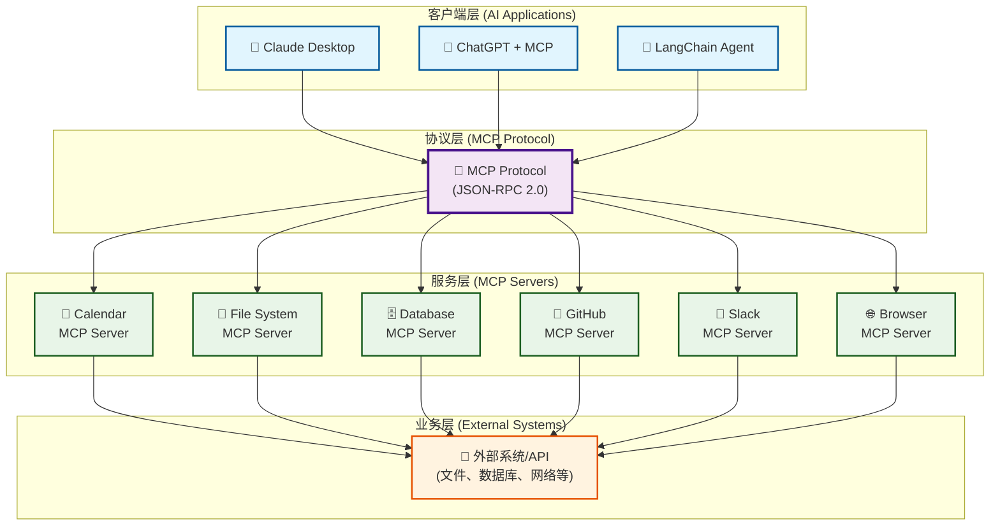
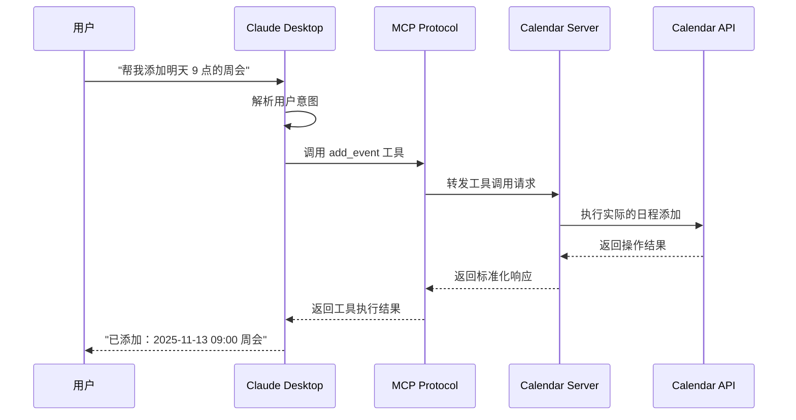

# AI Agent 与 MCP 入门实践手册

值得一提的是，我们想要讲述的是现在ai（其实用ai并不准确，叫做LLM（large language model）更对一点）在应用方面的相关内容，所以传统的数据分析，机器学习，深度学习并不在这的讨论范围内，之后会另外授课讨论
关于我们首先要学会使用AI和搜索引擎这档事（没错，这是在AI给的回答上修改的）

## 一、从 AI 应用说起：现在的 AI 系统在干什么

过去我们用 AI，是「调用一个模型 → 输出一个结果」。

- 图像识别：输入图片输出标签（yolo）
- 语音识别：输入声音输出文本（so-vits-svc）
- 文本生成：输入提示词输出文本(chatgpt)

现在的 AI 应用已经升级成了「多步骤、多工具、具备记忆和决策能力的系统」，
 比如：

- Copilot 自动生成并执行代码；
- ChatGPT 可以访问文件、网页、数据库；
- Deepwiki/ Deepwiki-Open 帮你快速阅读代码。

这种“能规划、能执行、能用工具”的系统，就是Agent（智能体）。

---

## 二、Agent（智能体）是什么

### 1. 定义

Agent 是一个由 LLM 驱动的可感知、可思考、可执行的智能体。
它可以：

- 感知环境（理解输入、上下文）
- 规划目标（思考下一步）
- 调用工具（执行外部操作）
- 学习记忆（改进行为）

### 2. 核心结构

┌─────────────┐
│  User Input │
└──────┬──────┘
       │
┌──────▼──────┐
│  LLM Reason │ ← 思考与决策
└──────┬──────┘
       │  调用
┌──────▼──────┐
│ Tools / APIs│ ← 外部能力
└──────┬──────┘
       │  结果反馈
┌──────▼──────┐
│  Memory     │ ← 记忆上下文
└─────────────┘

### 实际应用场景

- 代码助理：自动生成、重构并运行测试，必要时调用本地 CLI。
- 企业客服：先规划检索 → 查知识库 → 调用工单系统 → 反馈用户。
- 数据自动化：定时从 API 抓数 → 清洗 → 写入数据库 → 告警。
- 个人助理：管理日程、邮件与文件，跨应用执行动作。

### 四大能力与常用实现

- 感知（Perception）
  - 文本/结构化：Transformers、spaCy、Pydantic（入参/出参校验）
  - 语音/图像：Whisper/Vosk（ASR）、PaddleOCR/Tesseract（OCR）、CLIP/SigLIP（图像语义）
- 规划（Planning）
  - ReAct、CoT（Chain-of-Thought）、ToT（Tree-of-Thoughts）
  - LangGraph（图式工作流/有状态代理）、AutoGen、Semantic Kernel Planner
- 调用工具（Action / Tool Use）
  - MCP Server/Client、OpenAI Function/Tool Calling、LangChain Tools、CLI（subprocess）、gRPC/REST
  - 工具描述与注册：JSON Schema、Pydantic、工具白名单与作用域（scope）
- 学习记忆（Memory）
  - 短期：会话缓冲、摘要窗口（summary buffer）
  - 长期：向量数据库（FAISS/Chroma/Milvus/Weaviate）、RAG、事件/语义/程序性记忆

> 本节要点
>
> - 选择“可观测、可替换”的实现以便排错与演进
> - 规划/行动/记忆解耦，避免耦合带来的复杂度

#### 真实世界 Agent 案例

- GitHub Copilot Workspace（代码工作台）
  - 感知：解析仓库结构、代码语义与现有测试；读取 Issue/PR 上下文
  - 规划：根据任务拆解为“修改点 → 运行测试 → 修复失败 → 提交 PR”的多步流程
  - 执行：自动编辑多文件、运行本地命令（构建/测试/格式化）
  - 记忆：在同一工作空间内持续跟踪历史更改与失败用例，累积上下文
- Cursor AI（IDE 内置 Agent）
  - 感知：理解光标处与文件级语境、项目依赖与类型信息（LSP）
  - 规划：生成重构计划，逐步应用、验证与回滚
  - 执行：批量修改代码、运行命令、插入注释与测试样例
  - 记忆：会话级记忆保持编辑意图与偏好；项目级记忆持久化重要决策
- Devin（全栈软件 Agent）
  - 感知：综合浏览器、终端、编辑器与外部文档的信息
  - 规划：里程碑/任务/子任务分层规划，动态调整路径
  - 执行：自动编写代码、安装依赖、运行脚本与部署
  - 记忆：长期跟踪项目状态、未完成事项与已验证结论

> 本节要点
>
> - 真实产品普遍具备“感知→规划→执行→记忆”的闭环能力
> - 关键差异在于：工具覆盖面、可观测性与对失败的自恢复能力

---

## 三、为什么要有协议

Agent 想调用外部系统时，会遇到问题：

- 每个系统接口都不同；
- 工具描述不统一；
- 权限和安全难管控；
- LLM 不知道工具能干什么。

### MCP 之前的混乱状况

在 MCP 协议出现之前，AI Agent 调用外部工具是一个极其混乱的过程：

#### 1. 接口标准各自为政

每个服务都有自己的一套规则：

- **GitHub API**：RESTful，需要 Bearer Token，返回 JSON
- **Slack Bot**：Webhook + OAuth，事件驱动，特殊的消息格式
- **数据库**：SQL 查询，连接池管理，事务处理
- **文件系统**：本地路径操作，权限检查，异步 I/O
- **浏览器自动化**：Selenium/Playwright，DOM 选择器，页面等待

每接入一个新工具，开发者都要：

```python
# 为每个工具写专门的适配代码
class GitHubTool:
    def __init__(self, token):
        self.headers = {"Authorization": f"Bearer {token}"}
    
    def create_issue(self, repo, title, body):
        # GitHub 特有的 API 调用逻辑
        pass

class SlackTool:
    def __init__(self, webhook_url):
        self.webhook = webhook_url
    
    def send_message(self, channel, text):
        # Slack 特有的消息格式
        pass

# 每个工具都需要不同的错误处理、重试逻辑、参数验证...
```

#### 2. 工具描述混乱不堪

LLM 需要知道"这个工具能做什么"，但每个系统的描述方式都不同：

```python
# 方式1：硬编码在提示词里
system_prompt = """
你可以使用以下工具：
- send_email(to, subject, body) - 发送邮件
- query_database(sql) - 查询数据库，注意SQL注入
- read_file(path) - 读取文件，路径不能包含..
"""

# 方式2：JSON Schema，但每家格式不同
github_schema = {
    "name": "create_issue",
    "description": "Create a GitHub issue",
    "parameters": {
        "type": "object",
        "properties": {
            "repo": {"type": "string"},
            "title": {"type": "string"}
        }
    }
}

# 方式3：OpenAI Function Calling 格式
openai_function = {
    "name": "send_email",
    "description": "Send an email",
    "parameters": {
        "type": "object",
        "properties": {
            "to": {"type": "string", "description": "Recipient email"}
        },
        "required": ["to"]
    }
}
```

#### 3. 权限管理一团糟

没有统一的权限模型，每个工具都要单独处理：

```python
# 每个工具都要自己实现权限检查
def read_file(path):
    # 手动检查路径穿越
    if ".." in path or path.startswith("/"):
        raise SecurityError("Invalid path")
    
    # 手动检查白名单
    if not path.startswith("/safe/workspace/"):
        raise SecurityError("Path not in whitelist")
    
    # 手动检查文件大小
    if os.path.getsize(path) > 10 * 1024 * 1024:
        raise SecurityError("File too large")

def run_sql(query):
    # 手动 SQL 注入检查
    dangerous_keywords = ["DROP", "DELETE", "UPDATE", "INSERT"]
    if any(keyword in query.upper() for keyword in dangerous_keywords):
        raise SecurityError("Dangerous SQL detected")
```

#### 4. 调试和监控困难

每个工具的日志格式、错误处理都不同：

```python
# 工具A：打印到控制台
def tool_a():
    print(f"[{datetime.now()}] Tool A called")

# 工具B：写入文件
def tool_b():
    with open("tool_b.log", "a") as f:
        f.write(f"Tool B executed at {time.time()}\n")

# 工具C：发送到监控系统
def tool_c():
    metrics.increment("tool_c.calls")
```

#### 5. 版本兼容性噩梦

不同版本的工具接口经常变化：

```python
# v1.0
def send_notification(message):
    pass

# v2.0 - 破坏性变更
def send_notification(recipient, message, priority="normal"):
    pass

# v3.0 - 又变了
def send_notification(config: NotificationConfig):
    pass
```

这里有一张非常经典的图
（示意图描述：多种 USB 接口（Type-A、Type-B、Micro-USB、Type-C）形状各异，需转接/协议适配；MCP 即为统一适配层。）

就像 USB 接口的发展历程一样：

- **USB 1.0/2.0 时代**：各种奇形怪状的接口（Mini-USB、Micro-USB、专用接口）
- **USB-C 时代**：一个接口统一所有设备

MCP 协议就是 AI 工具调用领域的"USB-C"——统一的接口标准。

> 小结：标准化协议消除了"每接一个系统就写一套适配"的重复劳动，让 LLM 聚焦在规划与决策。没有什么是加一层中间层解决不了的，如果有，那就再加一层！

---

## 四、MCP（Model Context Protocol）：AI 与外部世界的通用接口

### 1. 定义与核心价值

**MCP（Model Context Protocol）** 是一种开放协议，定义了 AI 模型如何与外部工具安全、结构化地通信。它解决的核心问题是"Agent 调用工具的标准化"。

**核心价值：**

- **统一接口**：一套协议适配所有工具，告别"每个系统写一套适配器"
- **安全可控**：内置权限管理、参数验证和作用域隔离
- **跨平台复用**：同一个 MCP Server 可被 Claude、ChatGPT、LangChain 等不同客户端调用
- **自动发现**：工具能力可枚举、可描述，模型自动理解可用功能

### 2. 架构图解



**数据流示例：**



### 3. MCP Server 能力模型

一个 MCP Server 可以暴露三种类型的能力：

#### **Resources（资源）**

只读的数据源，供模型查询和理解上下文

```json
{
  "resources": {
    "calendar_events": {
      "description": "用户的日程事件列表",
      "mimeType": "application/json"
    },
    "project_files": {
      "description": "项目文件树结构",
      "mimeType": "text/plain"
    }
  }
}
```

#### **Tools（工具）**

可执行的操作，模型可以调用来改变外部状态

```json
{
  "tools": {
    "add_event": {
      "description": "在指定日期新增日程",
      "parameters": {
        "type": "object",
        "properties": {
          "date": {"type": "string", "format": "date"},
          "title": {"type": "string"},
          "time": {"type": "string", "pattern": "^\\d{2}:\\d{2}$"}
        },
        "required": ["date", "title"]
      }
    },
    "delete_event": {
      "description": "删除指定的日程事件",
      "parameters": {
        "type": "object",
        "properties": {
          "event_id": {"type": "string"}
        },
        "required": ["event_id"]
      }
    }
  }
}
```

#### **Prompts（提示模板）**

预定义的提示词模板，帮助模型更好地理解任务

```json
{
  "prompts": {
    "schedule_conflict_check": {
      "description": "检查日程冲突的分析模板",
      "template": "分析以下日程是否存在时间冲突：\n{events}\n\n请指出具体的冲突并建议解决方案。"
    }
  }
}
```

**关键优势：**

✅ **标准化**：任何支持 MCP 的客户端（Claude、ChatGPT、LangChain 等）都能调用这个 Server  
✅ **类型安全**：JSON Schema 确保参数验证和返回值结构化  
✅ **自描述**：模型可以自动理解每个工具的用途和使用方法  
✅ **可扩展**：新增工具只需在 Server 端添加，客户端自动发现  

> **核心理念**：MCP 让"工具能力"变成了"可发现、可描述、可调用"的标准化服务，就像 Web API 让网络服务标准化一样。

### 4. 一个完整的 MCP Server（FastMCP 版）

说明：以下示例用 FastMCP 暴露两个工具 add_event 与 list_events，供支持 MCP 的客户端调用。

```python
# pip install fastmcp
from fastmcp import FastMCP

# 创建 MCP 服务器实例
app = FastMCP("calendar")
EVENTS: list[dict] = []

# 使用实例方法装饰器注册工具
@app.tool
def add_event(date: str, title: str) -> dict:
    """在指定日期新增日程"""
    EVENTS.append({"date": date, "title": title})
    return {"status": "ok"}

@app.tool
def list_events() -> list:
    """列出所有日程"""
    return EVENTS

# 运行服务器
if __name__ == "__main__":
    app.run()
```

### 5. 实际 Server 场景

- 文件系统访问（filesystem）
  - 工具：list_dir、read_file、write_file、search_in_files
  - 用途：受控地让模型读取/写入工作区文件，生成或修改配置、修复代码
  - 安全：白名单根目录、只读/只写分权、文件大小限制、路径穿越检查
- 数据库查询（database）
  - 工具：list_tables、get_schema、run_sql（带参数化）、explain_sql
  - 用途：生成 SQL、做数据分析/看板快问快答、数据质量巡检
  - 安全：只读 schema、SQL 白名单/模板、结果集行数上限、敏感列脱敏
- 浏览器自动化（browser/automation）
  - 工具：open_url、click、type、extract、screenshot
  - 用途：抓取资料、表单自动化、E2E 验证与回归检查
  - 安全：域名白名单、速率限制、验证码处理与人机分流

> 本节要点
>
> - MCP Server 将“系统能力”以工具/资源的方式抽象、可枚举、可权限化
> - 先做边界再做增强：限制作用域与数据范围，保留审计与回滚手段

### 6. 消息格式示例（JSON-RPC）

请求（调用工具）：

```json
{
  "jsonrpc": "2.0",
  "id": "42",
  "method": "tools/call",
  "params": {
    "name": "add_event",
    "arguments": { "date": "2025-11-12", "title": "周会" }
  }
}
```

响应（成功）：

```json
{
  "jsonrpc": "2.0",
  "id": "42",
  "result": { "ok": true, "data": { "date": "2025-11-12", "title": "周会" } }
}
```

响应（错误）：

```json
{
  "jsonrpc": "2.0",
  "id": "42",
  "error": { "code": -32602, "message": "invalid params: missing date" }
}
```

> 关键概念
>
> - JSON-RPC 基于 id 关联请求/响应；error 与 result 互斥
> - 工具名、参数对象与返回结构须遵循 Server 公布的 schema

### 7. 与传统 API / Function Calling 的对比

| 维度 | 传统 API（REST/gRPC） | Function Calling（函数调用） | MCP（Model Context Protocol） |
| --- | --- | --- | --- |
| 能力发现 | 无统一发现机制，需要读文档 | 由模型侧定义函数签名，缺少规范化注册 | 标准化工具/资源可枚举与描述，客户端可自动发现 |
| 通信方式 | HTTP/2、gRPC，请求-响应 | 通过模型调用函数，序列化 JSON | 标准 JSON-RPC/流式（由客户端决定），支持资源与行动 |
| 可移植性 | 接口风格不一，复用成本高 | 绑定特定模型/厂商，迁移成本中 | 跨客户端/模型复用同一 Server，迁移成本低 |
| 安全与权限 | API Key、OAuth | 依赖宿主环境权限 | 支持作用域（scope）、会话隔离与最小权限 |
| 适用场景 | B2B/服务之间直接通信 | 单一模型内的工具调用 | Agent/IDE/桌面客户端统一调用本地/远程工具 |

> 适用建议
>
> - 已有成熟后端服务：继续提供 REST/gRPC；对 Agent 开放时可加一层 MCP 以复用
> - 仅在单模型内少量工具：Function Calling 足够
> - 需要跨客户端/团队复用工具、强调权限与可观测：优先 MCP

---

### 对 AI Agent 的理解

上文的MCP的解释相对比较完备了，但是AI Agent这里还有一套更自然更优雅的定义：
AI Agent应该是一个可以同时满足下面两个条件的程序或者系统

- 核心逻辑由深度学习及其衍生技术实现（尤其是大模型技术）
- 是一个能够进行任务执行的下游应用，输入和输出都直接面向终端用户

#### 哪些不是 Agent

（示意图描述：仅有训练好的模型并非 Agent，它只是能力组件；缺少与用户交互、规划与执行闭环。）
（示意图描述：单一脚本/爬虫也不是 Agent，它没有 LLM 驱动的规划、记忆与工具编排能力。）

- 边界小结：
  - 只有模型 ≠ Agent；
  - 只有脚本/自动化 ≠ Agent；
  - 无规划、无记忆、无工具编排 ≠ Agent。

#### Agent 的三大核心组件

- Planning：对于agent对于给定一个给定的任务进行规划，将这个任务拆分为若干过子任务的过程
- Memory：agent对于之前的任务和环境的记忆
- Action：agent对于一个给定的任务进行执行的过程

补充说明：

- Planning（规划）：将任务拆分为可执行子任务，决定先后顺序与所需工具。例如“总结周报”可分为“拉取数据 → 分析 → 生成报告 → 发送邮件”。
- Memory（记忆）：长期/短期记忆，保存用户偏好、历史对话、已完成的子任务等，帮助持续优化策略。
- Action（执行）：依据规划选择并调用工具（MCP/函数/CLI/API），根据返回结果继续迭代直至完成目标。

实战建议：

- 先定义工具边界，再设计提示词与约束；
- 优先实现可观测性：记录思考、工具输入输出与错误；
- 将 Memory 抽象为可替换的后端（文件 / Redis / 向量库）。

#### 组件技术栈选型

- Planning（规划）
  - 模式：ReAct、CoT（Chain-of-Thought）、ToT（Tree-of-Thoughts）、Reflexion、自一致性（Self-Consistency）
  - 框架：LangChain Agents、LangGraph、AutoGen、Semantic Kernel Planner、LlamaIndex Agents
- Memory（记忆）
  - 短期：Checkpointer（InMemorySaver、PostgresSaver）、对话历史管理
  - 长期：FAISS/Chroma/Milvus/Weaviate、Pinecone、Redis/KV、SQLite/Postgres
  - 策略：RAG（分块/索引/召回）、记忆压缩（Summarization）、偏好学习
- Action/工具（执行）
  - 协议：MCP（工具/资源标准化）
  - 机制：OpenAI Function/Tool Calling、LangChain Tools、pydantic 工具、CLI 封装（subprocess）
  - 编排：注册/白名单、参数校验、超时/重试/熔断、并发与速率限制

> 关键概念
>
> - 提前定义清晰的输入/输出 schema，有利于模型理解与验证
> - 工具单一职责、小而美；复杂能力通过编排组合完成

### 如何自己实现 MCP / Agent

下面进入实践部分：使用 FastMCP 与 LangChain。

## 💻 完整示例代码

本教程配套了一系列完整的、可运行的示例代码，位于 [`examples/`](examples/) 目录下：

### 📁 示例代码清单

1. **[01_calendar_server.py](examples/01_calendar_server.py)** - MCP Server 基础示例
   - ✅ 完整的日历管理服务器实现
   - ✅ 5个实用工具函数（添加、列表、删除、更新、搜索）
   - ✅ 详细的代码注释和文档字符串
   - ✅ 包含配置说明和使用指南

2. **[02_langchain_basic_agent.py](examples/02_langchain_basic_agent.py)** - LangChain Agent 基础示例
   - ✅ ReAct 模式的完整实现
   - ✅ 工具定义和调用示例
   - ✅ 记忆系统的使用演示
   - ✅ 4个实际运行示例

3. **[03_code_agent_with_planning.py](examples/03_code_agent_with_planning.py)** - 完整的代码 Agent（具有规划能力）
   - ✅ 任务规划系统的完整实现
   - ✅ 6个专业级代码工具
   - ✅ 错误处理和日志记录
   - ✅ 完整的工作流程演示

4. **[04_integrated_mcp_langchain.py](examples/04_integrated_mcp_langchain.py)** - FastMCP + LangChain 端到端集成
   - ✅ FastMCP Server 与 LangChain Agent 的完整集成
   - ✅ 智能自然语言理解和日程管理
   - ✅ 5个内部 LangChain 工具
   - ✅ 4个对外 MCP 工具
   - ✅ 完整的端到端工作流程

5. **[README.md](examples/README.md)** - 详细的使用文档
   - ✅ 环境配置指南
   - ✅ 逐步运行说明
   - ✅ 代码解析和学习建议
   - ✅ 常见问题解答

### 📊 快速参考：示例与概念对应表

| 核心概念 | 文档位置 | 示例类型 | 可执行文件 |
|---------|---------|---------|-----------|
| **MCP 协议基础** | 行 125-159 | 📚 理论说明 | - |
| **MCP Server 实现** | 行 162-184 | 💡 简化示例 | [01_calendar_server.py](examples/01_calendar_server.py) (完整版) |
| **工具定义扩展** | 行 544-571 | 💡 代码片段 | 已包含在示例 1 中 |
| **Agent 核心能力** | 行 27-106 | 📚 理论说明 | - |
| **ReAct 规划模式** | 行 274-287 | 📚 概念伪代码 | [02_langchain_basic_agent.py](examples/02_langchain_basic_agent.py) (实际实现) |
| **LangChain Agent** | 行 593-658 | 💡 代码片段 | [02_langchain_basic_agent.py](examples/02_langchain_basic_agent.py) (完整版) |
| **记忆系统 (Memory)** | 行 295-308, 674-691 | 📚 理论 + 💡 片段 | 示例 2 的示例 4 展示 |
| **错误处理增强** | 行 619-658 | 💡 代码片段 | [03_code_agent_with_planning.py](examples/03_code_agent_with_planning.py) (完整实现) |
| **任务规划 (Planning)** | 行 64-82, 407-441 | 📚 理论说明 | [03_code_agent_with_planning.py](examples/03_code_agent_with_planning.py) (完整实现) |
| **工具调用流程** | 行 310-322 | 📚 概念伪代码 | 所有示例中均有实现 |
| **向量检索 (RAG)** | 行 295-308 | 📚 概念伪代码 | - |
| **端到端集成** | 行 708-731 | 💡 简化示例 | [04_integrated_mcp_langchain.py](examples/04_integrated_mcp_langchain.py) (完整版) |

**图例说明：**

- 📚 **理论说明** - 概念讲解，不含可执行代码
- 📚 **概念伪代码** - 用于理解概念的简化代码，不可直接运行
- 💡 **代码片段** - 部分代码示例，需要在完整项目中使用或参考完整版
- ✅ **完整示例** - 可直接运行的完整 Python 文件

### 🚀 快速开始

```bash
# 1. 进入示例目录
cd examples/

# 2. 安装依赖
pip install fastmcp langchain langchain-openai

# 3. 设置 API 密钥（示例 2 和 3 需要）
export OPENAI_API_KEY=your_key_here

# 4. 运行任意示例
python 01_calendar_server.py
python 02_langchain_basic_agent.py
python 03_code_agent_with_planning.py
python 04_integrated_mcp_langchain.py
```

### 📚 学习路径

**初学者：** 建议按顺序学习示例 1 → 2 → 3 → 4

**有经验开发者：** 可以直接查看示例 3 和 4，了解完整的 Agent 实现

**详细说明：** 请查阅 [examples/README.md](examples/README.md) 获取完整的使用指南

---

## 实践：FastMCP 与 LangChain

> **注意：** 以下内容为理论说明。完整的、可运行的代码请参考上方 [`examples/`](examples/) 目录。

### 实践 A：FastMCP 快速上手

1. 安装：`pip install fastmcp`
2. 编写 Server：参考上文“更完整示例”。
3. 启动：`python calendar_server.py`
4. 连接客户端：在支持 MCP 的客户端中注册该 Server（根据各客户端文档配置）。

#### 客户端注册（Claude Desktop 为例）

- 常见配置文件路径（不同平台）：
  - macOS：~/Library/Application Support/Claude/claude_desktop_config.json
  - Windows：%APPDATA%\\Claude\\claude_desktop_config.json
  - Linux：~/.config/Claude/claude_desktop_config.json

在配置文件中新增一段 mcpServers 配置（示例字段，以客户端文档为准）：

```json
{
  "mcpServers": {
    "calendar": {
      "command": "python",
      "args": ["<你的绝对路径>/calendar_server.py"],
      "env": {}
    }
  }
}
```

- 保存后重启 Claude Desktop
- 运行效果：在对话里输入“列出工具”应能看到 add_event/list_events；试问“帮我添加明天 9 点的周会”可触发工具调用

参考：MCP 官方“连接本地服务器”与 Claude 文档

#### 更多工具函数（FastMCP）

> 💡 完整可运行实现请参考: [`examples/01_calendar_server.py`](examples/01_calendar_server.py)

```python
# 💡 代码片段 - 这些函数已包含在示例 1 中
from fastmcp import FastMCP

mcp = FastMCP("calendar")
EVENTS: list[dict] = []

@mcp.tool
def delete_event(date: str, title: str) -> dict:
    """删除指定日期与标题的日程，返回删除条目或报错"""
    for i, e in enumerate(EVENTS):
        if e.get("date") == date and e.get("title") == title:
            removed = EVENTS.pop(i)
            return {"ok": True, "removed": removed}
    raise ValueError("not found")

@mcp.tool
def update_event(date: str, title: str, new_title: str) -> dict:
    """更新指定日程标题"""
    for e in EVENTS:
        if e.get("date") == date and e.get("title") == title:
            e["title"] = new_title
            return {"ok": True, "item": e}
    raise ValueError("not found")

@mcp.tool
def search_events(keyword: str) -> list[dict]:
    """按关键词模糊搜索标题，返回匹配的日程列表"""
    kw = keyword.lower()
    return [e for e in EVENTS if kw in e.get("title", "").lower()]
```

> 本节要点
>
> - 尽量返回结构化结果（ok/data/error），便于模型理解与分支
> - 对"未找到"等可预期错误抛出明确异常并给出 message

#### 常见错误与调试技巧（FastMCP）

- 客户端无法发现工具
  - 检查 config 路径与 JSON 语法；确认可执行路径与 venv 一致；重启客户端
- 权限/路径问题
  - 文件系统类工具务必做白名单根目录与路径穿越检查
- JSON-RPC 参数不合法
  - 使用 Pydantic/JSON Schema 严格校验，错误时返回规范化 error.code/message
- 性能问题
  - 给每个工具设置超时与重试；大输出谨慎返回，必要时做分页或摘要

### 实践 B：用 LangChain 搭一个最小 Agent

> 💡 完整可运行实现请参考: [`examples/02_langchain_basic_agent.py`](examples/02_langchain_basic_agent.py)

依赖：`pip install langchain langchain-openai langgraph`，并设置环境变量 `OPENAI_API_KEY`。

**重要：LangChain v1.0 API 变更说明**

本文档已更新至 **LangChain v1.0** 的最新 API。主要变更如下：

| 旧 API（已弃用） | 新 API（v1.0） | 说明 |
|---|---|---|
| `create_react_agent` + `AgentExecutor` | `create_agent` | 统一的 Agent 创建方法 |
| `ConversationBufferMemory` | `checkpointer=InMemorySaver()` | 使用 Checkpointer 管理状态 |
| `PromptTemplate` | `system_prompt` 参数 | 直接传递系统提示词 |
| `executor.invoke({"input": "..."})` | `agent.invoke({"messages": [...]}, config)` | 新的调用方式 |

**注意：** LangChain 和 FastMCP 都有 `tool` 装饰器，但它们用途不同：

- **LangChain 的 `@tool`**：用于创建 LangChain Agent 内部使用的工具
- **FastMCP 的 `@mcp.tool`**：用于创建 MCP 协议服务器暴露的工具

在 LangChain 示例中，我们使用 `from langchain.tools import tool as langchain_tool` 来明确区分。

```python
# 💡 代码片段 - 完整版请参考示例 2
from langchain_openai import ChatOpenAI
from langchain.tools import tool as langchain_tool
from langchain.agents import create_agent
from langgraph.checkpoint.memory import InMemorySaver

@langchain_tool
def add_event(date: str, title: str) -> str:
    """调用业务层 API 新增日程（示例用打印代替）"""
    return f"已添加: {date} - {title}"

tools = [add_event]
llm = ChatOpenAI(model="gpt-4o-mini")
checkpointer = InMemorySaver()  # 提供记忆功能

system_prompt = "你是日程助理，按需调用工具。请遵循 ReAct 思考→行动→观察→总结。"

# 使用 LangChain v1.0 的 create_agent API
agent = create_agent(
    model=llm,
    tools=tools,
    system_prompt=system_prompt,
    checkpointer=checkpointer
)

# 使用新的调用方式
config = {"configurable": {"thread_id": "1"}}
result = agent.invoke({
    "messages": [{"role": "user", "content": "明天 9 点加个题为周会的会议"}]
}, config)
print(result['messages'][-1].content)
```

#### 增强版：错误处理、日志与失败重试

> 💡 错误处理的完整实现请参考: [`examples/03_code_agent_with_planning.py`](examples/03_code_agent_with_planning.py)

```python
# 💡 代码片段 - 展示错误处理概念
import logging, time
from langchain_openai import ChatOpenAI
from langchain.tools import tool as langchain_tool
from langchain.agents import create_agent
from langgraph.checkpoint.memory import InMemorySaver

logging.basicConfig(level=logging.INFO, format="%(asctime)s %(levelname)s %(message)s")

@langchain_tool
def add_event(date: str, title: str) -> str:
    for i in range(3):  # 简单重试
        try:
            # 这里替换为真实业务调用
            logging.info("add_event attempt=%s date=%s title=%s", i+1, date, title)
            return f"已添加: {date} - {title}"
        except Exception as e:
            logging.warning("add_event 失败: %s", e)
            time.sleep(0.5)
    raise RuntimeError("add_event 连续失败")

tools = [add_event]
llm = ChatOpenAI(model="gpt-4o-mini")
checkpointer = InMemorySaver()

system_prompt = "你是日程助理，按需调用工具。遵循 ReAct 思考→行动→观察→总结。"

# 使用 LangChain v1.0 的 create_agent API
agent = create_agent(
    model=llm,
    tools=tools,
    system_prompt=system_prompt,
    checkpointer=checkpointer
)

config = {"configurable": {"thread_id": "1"}}
try:
    result = agent.invoke({
        "messages": [{"role": "user", "content": "明天 9 点加个周会"}]
    }, config)
    print(result['messages'][-1].content)
except Exception as e:
    logging.exception("Agent 执行失败: %s", e)
```

运行效果（预期）：

- 日志打印每次工具调用与异常信息
- 解析失败不会导致崩溃
- 成功时输出包含“已添加: 日期 - 标题”的结果

要点：

- Planning 由系统提示词驱动；
- Memory 由 Checkpointer（InMemorySaver）提供对话历史和状态管理；
- Action 通过 @tool 装饰器暴露，并由 Agent 决策是否调用。

#### 多轮对话示例（Memory 生效）

> 💡 记忆功能的完整演示请参考: [`examples/02_langchain_basic_agent.py`](examples/02_langchain_basic_agent.py) 的示例 4

```python
# 💡 代码片段 - 展示记忆机制
from langchain_openai import ChatOpenAI
from langchain.agents import create_agent
from langchain.tools import tool as langchain_tool
from langgraph.checkpoint.memory import InMemorySaver

@langchain_tool
def remember_favorite(color: str) -> str:
    return f"已记录你喜欢的颜色: {color}"

llm = ChatOpenAI(model="gpt-4o-mini")
checkpointer = InMemorySaver()  # 提供记忆功能

# 使用 LangChain v1.0 的 create_agent API
agent = create_agent(
    model=llm,
    tools=[remember_favorite],
    checkpointer=checkpointer
)

# 使用同一个 thread_id 来维护会话状态
config = {"configurable": {"thread_id": "1"}}
result1 = agent.invoke({
    "messages": [{"role": "user", "content": "我最喜欢的颜色是蓝色"}]
}, config)
print(result1['messages'][-1].content)

result2 = agent.invoke({
    "messages": [{"role": "user", "content": "我喜欢的颜色是什么？"}]
}, config)  # 期望能利用历史回答出"蓝色"
print(result2['messages'][-1].content)
```

运行效果（预期）：

- 第二次问答能从对话历史里给出"蓝色"，因为使用了同一个 thread_id 维护会话状态。

#### 常见错误与调试技巧（LangChain）

- 工具参数解析失败/非 JSON 输出
  - 方案：使用 StructuredOutputParser/JSON 辅助提示；handle_parsing_errors=True；提供格式示例 few-shot
- 死循环与无效迭代
  - 方案：限制 max_iterations 与 early_stopping_method；加入“反思”提示；为工具增加失败冷却
- 可观测性不足
  - 方案：verbose=True、打印工具 I/O；在生产对接 LangSmith（见下文）
- 速率限制与 API 失败
  - 方案：配置重试策略与退避；对幂等调用做去重；对关键步骤做缓存

### 实践 C：端到端综合示例（FastMCP + LangChain）

> ✅ 完整可运行实现请参考: [`examples/04_integrated_mcp_langchain.py`](examples/04_integrated_mcp_langchain.py)

场景：智能日程助手（Claude 通过 MCP 调用我们的 Server；Server 内部用 LangChain 完成规划与行动）。

流程（ASCII）：

```text
User → Claude Desktop → MCP Server(calendar) → LangChain Agent → 工具/API → Result
```

代码（服务器侧）：在 FastMCP 中暴露一个 smart_schedule 工具，内部调用 LangChain 解析与编排，最终触发 add_event。

```python
# 💡 简化示例 - 完整版请参考示例 4
from fastmcp import FastMCP
from langchain_openai import ChatOpenAI
from langchain.agents import create_agent
from langchain.tools import tool as lc_tool

app = FastMCP("calendar")

# 内部 LangChain 工具
@lc_tool
def parse_schedule(text: str) -> dict:
    """解析自然语言日程"""
    # 这里可用 LLM 提取日期/标题
    return {"date": "2025-11-12", "title": "周会"}

# 创建内部 Agent
llm = ChatOpenAI(model="gpt-4o-mini")
internal_agent = create_agent(
    model=llm,
    tools=[parse_schedule],
    system_prompt="你是日程解析助手"
)

# 暴露给 MCP 的工具
@app.tool
def smart_schedule(nl: str) -> dict:
    """智能解析自然语言并创建日程"""
    config = {"configurable": {"thread_id": "default"}}
    result = internal_agent.invoke({
        "messages": [{"role": "user", "content": nl}]
    }, config)
    return {"action": "add_event", "result": result['messages'][-1].content}

if __name__ == "__main__":
    app.run()
```

运行效果（预期）：

- Claude 接入后，输入"帮我安排明天 9 点周会"将调用 smart_schedule
- Server 内部解析后返回结构化建议，或直接调用 add_event 并返回状态
- 可在日志中观测到 LangChain 的决策与工具 I/O

**📖 完整实现说明：**

示例 4 ([`04_integrated_mcp_langchain.py`](examples/04_integrated_mcp_langchain.py)) 包含：

- 智能自然语言理解（解析"明天"、"下周"等相对日期）
- 5个内部 LangChain 工具（日期解析、事件管理、时间建议等）
- 4个对外 MCP 工具（智能调度、简单添加、查询、清空）
- 完整的错误处理和日志记录
- 详细的架构说明和使用文档

---

## 开发 MCP Server 的最佳实践

- 工具命名规范：动词_名词（如 add_event），避免歧义
- 参数校验：使用 Pydantic/JSON Schema；对日期/邮箱等做格式校验
- 安全性：最小权限原则、作用域（scope）隔离；不把机密直接暴露给模型；必要时审计日志
- 超时与失败策略：为外部调用设置超时、重试、熔断；保证幂等（如使用去重键）
- 可观测性：记录请求/响应摘要、错误码、耗时；避免记录敏感原文
- 文档与自描述：为每个工具写清楚 docstring、示例与边界，便于模型理解

> 本节要点
>
> - “清晰的 schema + 最小权限 + 可观测”是生产可用的三件套
> - 同一个工具不要“既做这又做那”，保持单一职责

---

## Agent 开发常见问题与解决方案

- 工具调用死循环
  - 症状：模型在“思考→行动”之间反复横跳
  - 解决：设置 max_iterations/early_stopping；添加反思/reflection 步骤；为工具增加冷却时间与重试上限
- 上下文溢出/对话太长
  - 解决：对历史做摘要（summary）、基于检索的拼接（RAG），限制窗口长度，压缩中间推理链条
- 成本与延迟过高
  - 解决：缓存（prompt/检索/工具调用）；优先使用小模型+升级策略；并发/批量化；合理的温度与 top-p
- 工具选择错误
  - 解决：为工具写清楚“何时使用/不该使用”；给出正反例；在提示词加入强约束
- 非确定性导致结果不稳定
  - 解决：Self-Consistency 多样本投票、约束解码、规则校验与回退策略

---

## 推荐学习资源

- MCP 官方站点：[modelcontextprotocol.io](https://modelcontextprotocol.io/)
- MCP GitHub 组织：[github.com/modelcontextprotocol](https://github.com/modelcontextprotocol)
- Claude Docs（MCP）：[docs.claude.com/en/docs/mcp](https://docs.claude.com/en/docs/mcp)
- FastMCP 官网与文档：[gofastmcp.com](https://gofastmcp.com/) ；Python SDK：[github.com/modelcontextprotocol/python-sdk](https://github.com/modelcontextprotocol/python-sdk)
- FastMCP 社区实现（Python）：[github.com/jlowin/fastmcp](https://github.com/jlowin/fastmcp)
- LangChain 文档：[docs.langchain.com](https://docs.langchain.com/)
- LangGraph 文档（Python）：[docs.langchain.com/oss/python/langgraph/overview](https://docs.langchain.com/oss/python/langgraph/overview)
- LlamaIndex 文档（Python）：[developers.llamaindex.ai/python/framework/](https://developers.llamaindex.ai/python/framework/)
- ReAct 论文（arXiv）：[arxiv.org/abs/2210.03629](https://arxiv.org/abs/2210.03629)

---

## 总结与下一步

- 你已经掌握：Agent 核心能力、MCP 的定位与对比、FastMCP/LangChain 的实践路径
- 推荐下一步：
  1. 本地启动 calendar MCP Server，并在 Claude Desktop 完成接入验证
  2. 将 Memory 接到向量库（如 Chroma/FAISS），试做“跨会话记忆”
  3. 用 LangGraph 将“规划→行动→反馈”做成可观测的状态机
  4. 为工具加入 Pydantic 校验、超时与重试，跑一轮压力与异常测试

有坑别怕，边做边调，遇到问题我们继续修修补补就好 QAQ
